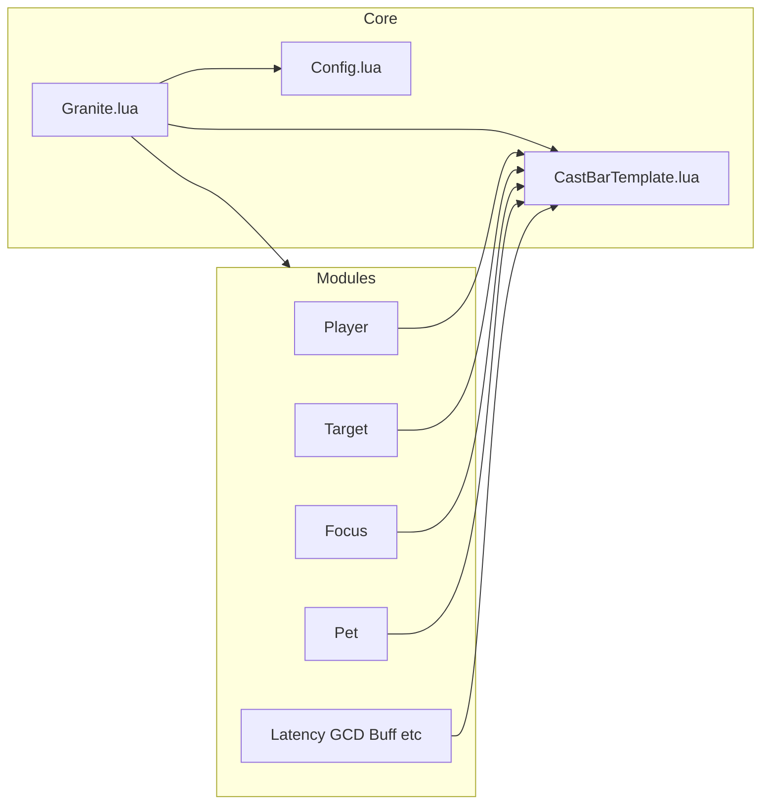

# Granite WoW Addon – Build Plan

## Context

- **Quartz** is GPLv2, modular, and uses Ace3 + LibSharedMedia. It is unmaintained and breaks under 12.0.0/12.0.1 API changes.
- **Granite** will be a from-scratch addon inspired by Quartz: same idea (modular cast bars), new code and structure, compatible with 12.0.
- **Retail only**: Granite targets **Retail World of Warcraft only** (12.0.1 and current patch). There is no plan to support Classic, Wrath Classic, or other clients. Implementation should use only modern 12.0.1 UI methods and Retail API semantics—no `WOW_PROJECT_ID` branching, no LibClassicCasterino, no Classic-specific TOC or return-value handling.
- **License**: GPLv2. Repository must be open source. If you copy any Quartz code verbatim or closely, preserve Quartz's copyright notices in those files and distribute under GPLv2.

---

## 1. License and Legal (GPLv2)

- Add a **GPLv2** license file in the repo (e.g. `COPYING` or `GPLv2.txt`; full license text).
- Use **GPLv2** for the whole addon so it can be shared and modified; state this in the `.toc` (e.g. `## X-License: GPL v2`) and in the README.
- **Copyright**:
  - Your own files: use your name and year (e.g. "Copyright (C) 2025 Your Name").
  - Any file that contains code taken or adapted from Quartz: keep the original notices (Nymbia, Nevcairiel) and add "Portions based on Quartz (GPLv2) by Nymbia, Nevcairiel" (or similar). Do not remove their copyright.
- **README**: mention that Granite is GPLv2, link to the license file, and note inspiration from Quartz (and credit if you reuse code).

---

## 2. Project Layout and Dependencies

**Suggested folder structure:**

```
Granite/
  Granite.toc
  GPLv2.txt (or COPYING)
  README.md
  Granite.lua           # Entry, AceAddon core
  Config.lua            # AceConfig-3.0 options
  CastBarTemplate.lua   # Reusable cast bar frame logic
  GraniteStatusBar.lua   # Optional: status bar widget (or use default)
  locale/
    locale.xml
    enUS.lua (default locale)
  modules/
    Player.lua
    Target.lua
    Focus.lua
    Pet.lua
    Latency.lua
    GCD.lua
    Buff.lua
    Mirror.lua
    Timer.lua
    Swing.lua
    Interrupt.lua
    Range.lua
    Flight.lua
    EnemyCasts.lua
    Tradeskill.lua
  textures/             # Optional: default bar textures, or rely on SharedMedia
  libs/                 # Embedded libs (see below)
```

**Libraries (same idea as Quartz):**

- **Ace3** (via LibStub): AceAddon-3.0, AceConsole-3.0, AceDB-3.0, AceConfig-3.0, AceEvent-3.0, AceTimer-3.0, AceHook-3.0, AceLocale-3.0, AceGUI-3.0, AceDBOptions-3.0, CallbackHandler-1.0.
- **LibSharedMedia-3.0** (and optionally AceGUI-3.0-SharedMediaWidgets for font/statusbar pickers in options).
- **Optional**: LibWindow-1.1 (position save/restore), LibDualSpec-1.0 (per-spec settings).

Either **embed** these under `libs/` (like Quartz) or depend on them as **OptionalDeps** in the `.toc` and document required addons (e.g. Ace3, SharedMedia). Embedding avoids "addon not loading" when a lib is missing.

**Granite.toc** (concept):

- `## Interface: 12000` (Retail 12.0.1 only; no Classic or other client TOC files).
- `## OptionalDeps: Ace3, LibSharedMedia-3.0, SharedMedia` (if not embedding).
- `## SavedVariables: GraniteDB`
- Load order: LibStub → CallbackHandler → Ace* → LibSharedMedia → your Core (Granite.lua, Config.lua, CastBarTemplate, …) → modules.

---

## 3. 12.0.1 Retail API (Modern UI Methods Only)

- **Cast bar APIs**: Use `UnitCastingInfo(unit)` and `UnitChannelInfo(unit)` with **Retail 12.0.1 return signatures only**. No `WOW_PROJECT_ID` checks or Classic return-value handling; assume mainline semantics (e.g. `notInterruptible` in the Retail position).
- **Events**: Use the standard Retail cast events:
  - `UNIT_SPELLCAST_START`, `UNIT_SPELLCAST_STOP`, `UNIT_SPELLCAST_FAILED`, `UNIT_SPELLCAST_DELAYED`, `UNIT_SPELLCAST_INTERRUPTED`
  - `UNIT_SPELLCAST_CHANNEL_START`, `UNIT_SPELLCAST_CHANNEL_UPDATE`, `UNIT_SPELLCAST_CHANNEL_STOP`
  - `UNIT_SPELLCAST_EMPOWER_START`, `UNIT_SPELLCAST_EMPOWER_UPDATE`, `UNIT_SPELLCAST_EMPOWER_STOP`
  - `UNIT_SPELLCAST_INTERRUPTIBLE`, `UNIT_SPELLCAST_NOT_INTERRUPTIBLE` (for non-player units)
- **Empower / charge spells**: Use `GetUnitEmpowerHoldAtMaxTime(unit)` and `GetUnitEmpowerStageDuration(unit, stage)` for player empower bars; handle `numStages` from channel/cast APIs as in current Retail.
- **Secure frames**: Cast bar *display* does not require SecureActionButtonTemplate. Avoid secure-only attributes or macrotext unless you add a dedicated secure click path (e.g. cancel cast). Use only modern 12.0.1 UI patterns.

Design the core and CastBarTemplate around Retail-only, 12.0.1 APIs so there is no legacy or multi-client code paths.

---

## 4. Architecture (Inspired by Quartz, Implemented Fresh)




- **Granite.lua**: AceAddon-3.0 addon; creates `GraniteDB` via AceDB-3.0; defines default profile (bar positions, colors, which modules are on, etc.); registers `/granite` (AceConsole-3.0); applies settings and enable/disable to modules; provides unlock/lock for bar movement; optional config mode callback for Blizzard's Edit Mode if desired.
- **Config.lua**: Uses AceConfig-3.0 to build the options table (per-module toggles, bar size/position/alpha/strata, fonts, textures, borders, colors). Can use AceGUI-3.0-SharedMediaWidgets for LSM font/statusbar/border selectors. Options should read/write the same profile used by the core and modules.
- **CastBarTemplate.lua**: Shared frame "template" used by bar modules. Responsibilities:
  - Create one frame per bar (player, target, focus, pet, mirror, etc.) with: status bar, icon, spell name text, time text, spark, optional shield for not-interruptible.
  - OnUpdate: update bar value, spark position, and time text (count up or down) from `startTime`/`endTime`/`delay`; handle fade-out when cast ends.
  - Event handlers: map UNIT_SPELLCAST_* and UNIT_SPELLCAST_CHANNEL_* (and EMPOWER_*) to set start/end/delay, interruptible state, icon, name; call UnitCastingInfo/UnitChannelInfo using Retail 12.0.1 return signatures only.
  - ApplySettings: size, position (LibWindow if used), texture (LibSharedMedia statusbar), font (LSM), border (LSM), colors, icon position, lock/unlock.
- **Modules**: Each module (Player, Target, Focus, Pet, Latency, GCD, Buff, Mirror, Timer, Swing, Interrupt, Range, Flight, EnemyCasts, Tradeskill) is an AceAddon module. It creates a bar from the template (or a small factory that uses the template), registers only the events it needs, and optionally extends behavior (e.g. Player: channel ticks, empower stages; Latency: lag indicator; Range: color by range). No copy-paste of Quartz code required; reimplement behavior from specs and current API docs.

This keeps a single Retail-only cast-bar implementation path using modern 12.0.1 UI methods, shared across all bar types.

---

## 5. Feature Scope (Module List)


| Module     | Purpose                                                                   |
| ---------- | ------------------------------------------------------------------------- |
| Player     | Player cast bar; hide Blizzard bar; channel ticks; empower/charge stages. |
| Target     | Target cast bar.                                                          |
| Focus      | Focus cast bar.                                                           |
| Pet        | Pet cast bar.                                                             |
| Latency    | Show latency on player bar (e.g. red segment).                            |
| GCD        | Global cooldown indicator.                                                |
| Buff       | Buff/debuff bars (optional).                                              |
| Mirror     | Mirror bar (e.g. incoming rez, etc.).                                     |
| Timer      | Simple timer bar.                                                         |
| Swing      | Melee swing / autoshot timer.                                             |
| Interrupt  | Interrupt detection / feedback.                                           |
| Range      | Recolor or dim when target out of range.                                  |
| Flight     | Flight path progress.                                                     |
| EnemyCasts | Enemy cast display (if API allows).                                       |
| Tradeskill | Tradeskill cast bar.                                                      |


Implement in phases: core + Player first, then Target/Focus/Pet, then Latency/GCD, then the rest. This gets a usable addon quickly and validates 12.0 compatibility before expanding.

---

## 6. Implementation Phases

**Phase 1 – Skeleton and player bar**

- Create repo, GPLv2, README, copyright headers.
- Set up Granite.toc (Interface 12000), SavedVariables, and lib loading (embedded or OptionalDeps).
- Implement Granite.lua (addon core, defaults, profile, `/granite`), Config.lua (minimal options: enable Granite, enable Player module).
- Implement CastBarTemplate: one bar frame, UnitCastingInfo/UnitChannelInfo with Retail 12.0.1 return parsing only, UNIT_SPELLCAST_* (and CHANNEL_*, EMPOWER_*) events, OnUpdate, basic styling (size, position, texture from LSM, font).
- Implement Player module: one bar bound to `player`, hide Blizzard casting bar when enabled.
- Test in Retail 12.0.1: cast, channel, interrupt, fail, empower if applicable.

**Phase 2 – More unit bars and options**

- Add Target, Focus, Pet modules (each uses CastBarTemplate with its unit).
- Extend Config: per-bar options (width, height, position, alpha, strata, icon, text position, colors, not-interruptible styling).
- Unlock/lock bar movement (LibWindow if used); save/restore positions.

**Phase 3 – Player bar extras**

- Channel ticks on player bar (spell list + tick positions).
- Empower/charge stages (GetUnitEmpowerHoldAtMaxTime, GetUnitEmpowerStageDuration, stage markers on bar).
- Latency module (lag segment on player bar).
- GCD module (GCD bar or overlay).

**Phase 4 – Remaining modules**

- Mirror, Timer, Swing, Buff (if desired), Interrupt, Range, Flight, EnemyCasts, Tradeskill. Implement one by one, reusing CastBarTemplate where applicable and hooking only the events/callbacks needed.

**Phase 5 – Polish**

- Localization (enUS at least; AceLocale).
- Blizzard Edit Mode integration (optional): register with CONFIGMODE_CALLBACKS so bars can be moved in Edit Mode if you choose.
- Documentation (README: install, options, slash command, license, credits).

---

## 7. Key Files to Use as Reference Only (No Direct Copy Without Attribution)

- Quartz: [Quartz](https://github.com/Nevcairiel/Quartz) – structure, event list, and option layout. Do not copy code verbatim unless you keep GPLv2 and Quartz's copyright; reimplement from API and behavior description.
- WoW 12.0.1 Retail: official patch notes and UI/addon changelog; [WoW API change summaries](https://addonstudio.org/wiki/WoW:API_change_summaries) and [WoWUIBugs](https://github.com/Stanzilla/WoWUIBugs) for Retail 12.0 issues (e.g. secure frame changes), so Granite uses only supported modern UI methods.

---

## 8. Summary Checklist

- **License**: GPLv2; license file + X-License in TOC + README; your copyright on new code; preserve Quartz copyright on any copied/adapted code.
- **Open source**: Publish repo (e.g. GitHub) with full source and clear license.
- **Retail 12.0.1 only**: Interface 12000; UnitCastingInfo/UnitChannelInfo with Retail return signatures only; all UNIT_SPELLCAST_* (including EMPOWER_*); empower helpers; no Classic or multi-client support; no reliance on removed/deprecated secure or macro APIs; modern 12.0.1 UI methods only.
- **Stack**: Ace3 + LibSharedMedia (and optionally LibWindow, LibDualSpec); embed or document deps.
- **Design**: Core + CastBarTemplate + modules; one template, many modules; implement in phases (Player first, then other bars and features).

This plan gives you a clear path to a Quartz-inspired, 12.0-compatible cast bar addon that stays GPLv2 and respects Quartz's copyright if you reuse any of their code.
